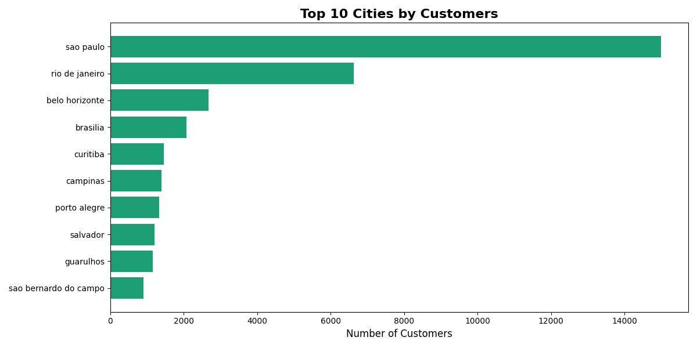
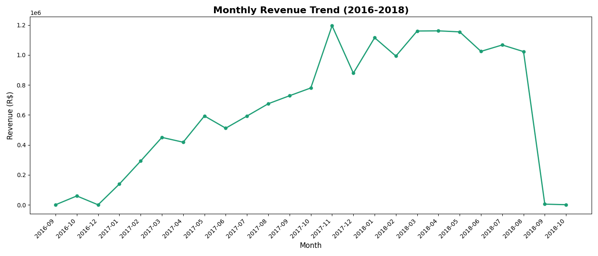
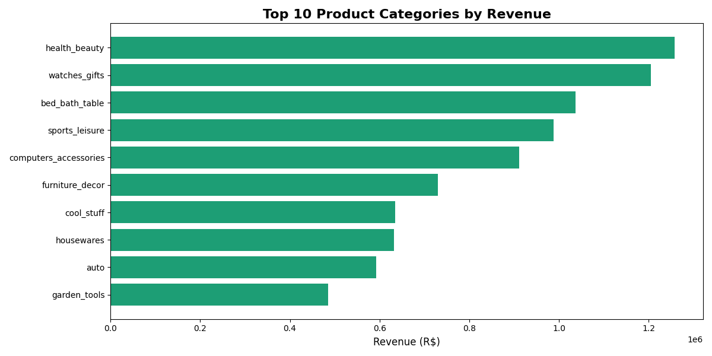
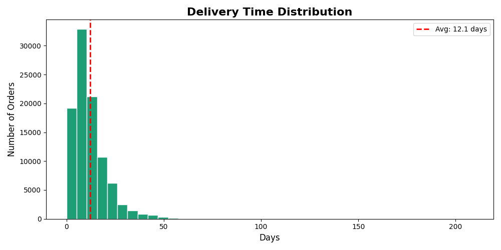
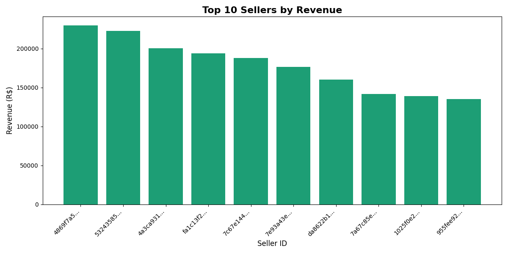
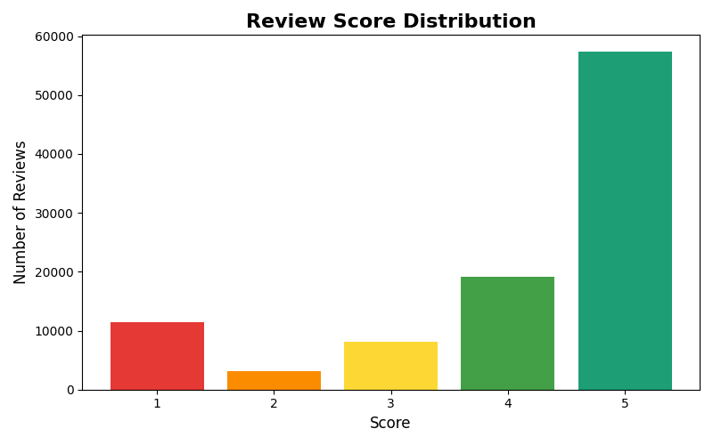
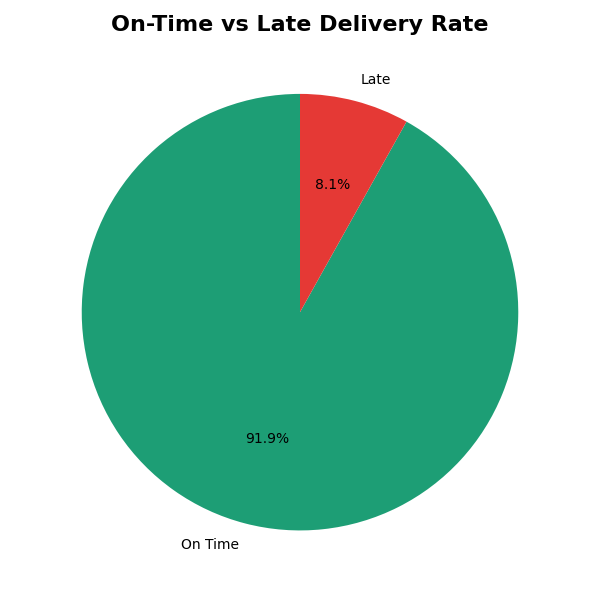

# E-Commerce SQL & Python Analysis

A comprehensive data analysis project using the Brazilian E-Commerce Dataset (Olist).
Analysed 100,000+ orders using MySQL and Python to uncover customer behaviour,
revenue trends, and delivery performance insights.

---

## Tech Stack

| Tool | Purpose |
|------|---------|
| MySQL | Database setup and SQL queries |
| Python | Data analysis and automation |
| Pandas | Data manipulation and aggregation |
| Matplotlib | Data visualisation and charts |
| GitHub | Version control and portfolio |

```
ecommerce-sql-analysis/
├── analysis_queries.sql   - All 10 SQL queries
├── Day1.py                - Pandas basics (load, explore, describe)
├── Day2.py                - Filtering, GroupBy, Merge
├── Day3.py                - Matplotlib charts (bar, pie, line)
├── Day4.py                - Full analysis replicating all 10 queries
├── charts/                - All generated chart images
└── README.md
```

## Dataset

- Source: Brazilian E-Commerce Dataset by Olist (Kaggle)
- Size: 100,000+ orders from 2016-2018
- Tables: 9 relational tables (customers, orders, payments, products, sellers, reviews, etc.)

---

## Analysis & Key Findings

### Query 1 - Total Unique Customers
- 96,096 truly unique customers identified using customer_unique_id
- Python revealed more accurate count vs SQL's 99,441 (which counted order-level IDs)

### Query 2 - Top 10 Cities by Customers
- Sao Paulo leads with 14,984 customers
- Rio de Janeiro second at 6,620



### Query 3 - Total Revenue
- Total platform revenue: R$ 16,008,872.12

### Query 4 - Payment Methods
- Credit card dominates at 78.3% of total revenue
- Boleto second at 17.9%


### Query 5 - Monthly Revenue Trend
- November 2017 was peak revenue month driven by Black Friday
- Clear upward growth trend from 2016 to late 2017



### Query 6 - Top Product Categories
- Health and Beauty is the number 1 revenue category at R$ 1,258,681
- Watches and Gifts second at R$ 1,205,005



### Query 7 - Average Delivery Time
- Average delivery time: 12.1 days
- Majority of orders delivered within 20 days



### Query 8 - Top Sellers by Revenue
- Top seller generated R$ 229,472 in revenue
- Clear concentration of revenue among top 3 sellers



### Query 9 - Review Score Distribution
- 57.8% of customers gave a 5-star review
- Strong overall customer satisfaction



### Query 10 - On-Time Delivery Rate
- 91.9% of orders delivered on time
- Only 8.1% delivered late



---

## Key Insights

1. Sao Paulo is the dominant market - targeted campaigns here would have maximum impact
2. Credit card is the overwhelmingly preferred payment method - optimising credit card UX is critical
3. Black Friday November 2017 drove the highest revenue spike - seasonal campaigns are highly effective
4. Health and Beauty is the top revenue category - ideal for inventory and marketing focus
5. 91.9% on-time delivery shows strong logistics performance - a key competitive advantage
6. Python analysis revealed 96,096 true unique customers vs 99,441 SQL count - demonstrating importance of data quality checks

---

## How to Run

SQL:
1. Load all 9 CSV files into MySQL database ecommerce_analysis
2. Run analysis_queries.sql in MySQL Workbench

Python:
1. Install dependencies: pip install pandas matplotlib
2. Update CSV file paths in each Day file to match your local directory
3. Run in order: Day1.py then Day2.py then Day3.py then Day4.py

---

## Author

Mohammad Maasir Quamar
BTech Computer Science | All Saints' College of Technology, Bhopal
